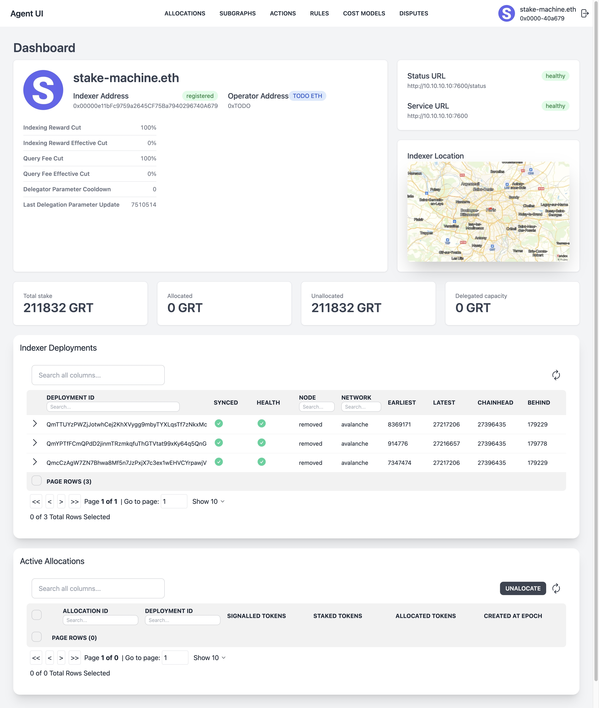

# Indexer Agent UI

**_HIGHLY EXPERIMENTAL_**: **_USE AT YOUR OWN RISK_**

The Indexer Agent UI allows you to manage your indexer operations simply via web.

## Features

- Indexing Rules: create and manage indexing rules
- Action queue: create actions and manage your actions queue
- Cost models: set your cost models
- Explore subgraphs: find subgraphs to index
- Deployments: monitor the progress of deployments you index
- Allocations: watch and manage your allocations
- Indexer info: view basic information about your indexer account

## Screenshots



## How to run

```bash
docker run -p 3000:3000 -d --network=<indexer-network> \
  -e NEXTAUTH_SECRET=$(openssl rand -base64 32) \
  -e UI_LOGIN=<username> \
  -e UI_PASS=<SecurePassword> \
  -e AGENT_ENDPOINT=http://indexer-agent:8000 \
  -e AGENT_NETWORK_ENDPOINT=https://gateway.thegraph.com/network \
  ghcr.io/stakemachine/indexer-agent-ui:latest
```

Not providing `NEXTAUTH_SECRET` will throw an error.  
If you use different public port, you also need to set `NEXTAUTH_URL` to the public URL that will be used to access the interface (example `http://<your-url>:9000`).

`AGENT_NETWORK_ENDPOINT` should point to the Graph Network gateway base URL (not a specific subgraph), for example:

- Mainnet: `https://gateway.thegraph.com/network`
- Testnet: `https://gateway.testnet.thegraph.com/network`

### Access Credentials

There is no default credentials, you always need to provide `UI_LOGIN` and `UI_PASS` env variables.

## If you want to contribute

First, run the development server:

```bash
pnpm install
pnpm dev
```

Open [http://localhost:3000](http://localhost:3000) with your browser to see the result.

This project uses the Next.js App Router (`app/` directory). Edit files under `app/` and components under `components/`.

Formatting & linting are handled by Biome. To check/fix locally:

```bash
pnpm biome:check
pnpm biome:fix
```

## Support

If you run into any issues while using the Indexer Agent UI, please open an issue in this repository.

## License

This project is licensed under the MIT License - see the [LICENSE](LICENSE) file for details.
